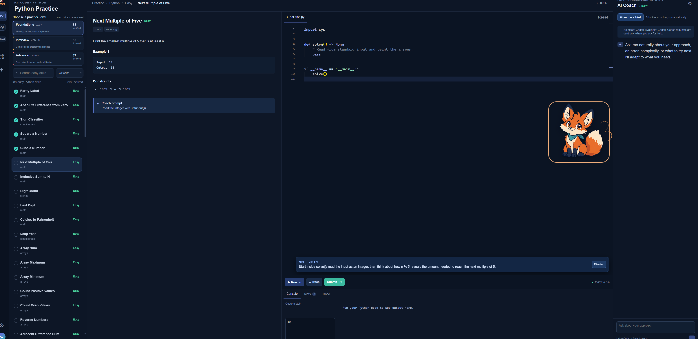

# KitCode Practice Studio

Practise Python, Java, and SQL on your Windows computer. No Git, terminal, or coding setup is needed.

  

## Start KitCode

1. Open the downloaded **`KitCode-Windows.zip`** file and select **Extract All**.
2. Open the extracted **`KitCode`** folder.
3. Double-click **`launch.bat`**.

KitCode opens in your browser. Keep the KitCode launcher window open while you practise; closing it stops the app.

> **First launch:** KitCode may need a few minutes and an internet connection while it prepares Python and the required packages. Later launches are much faster and the core exercises work offline.

> **Java exercises:** KitCode also tries to prepare Java automatically. If a managed school or work computer blocks that installation, Python and SQL still work.

## Need help?

See [Troubleshooting](TROUBLESHOOTING.md) if KitCode does not start.
